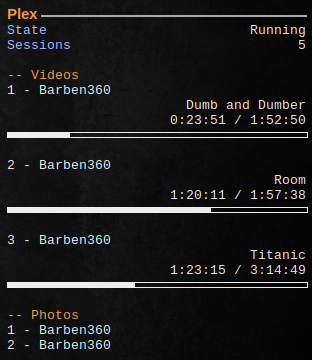

# Plex Server Monitoring Scripts for Conky

A series of python scripts made for monitoring your local or distant Plex server and seeing who is watching videos and photos on it.

## A Visual Example 

This is an example of what you can get using these scripts



Here, there is a single user running 5 sessions.


## Install

1. Put the python scripts anywhere
2. Create a text file you can call for instance `.plexcred` containing 3 lines:
   1. Your Plex username
   2. Your Plex password
   3. Your Plex server's address

If your Plex server is running on your local machine, its address should be `http://127.0.0.1:32400`

Everything is ready !

## Conky Script Example

Here are the lines in my Conky 1.10 script which render the image above.

```lua
${template0 Plex Media Server}
${template1 State}					${template3}${execi 5 ~/.conky/scripts/get_service_state.py plexmediaserver}
${template1 Sessions} ${template3} ${execi 20 ~/.conky/scripts/getplexcurrentsessions.py ~/.conky/plextmp.xml}

${color2}-- Videos
${color4}1 - ${execi 20 ~/.conky/scripts/getplexvideouser.py 0 ~/.conky/plextmp.xml}
${color4}${alignr}${execi 20 ~/.conky/scripts/getplexvideotitle.py 0 ~/.conky/plextmp.xml}
${color4}${alignr}${execi 20 ~/.conky/scripts/getplexvideoelapsedtime.py 0 ~/.conky/plextmp.xml} / ${color4}${execi 20 ~/.conky/scripts/getplexvideototaltime.py 0 ~/.conky/plextmp.xml}
${color4}${execibar 20 5 ~/.conky/scripts/getplexvideoperctime.py 0 ~/.conky/plextmp.xml}

${color4}2 - ${execi 20 ~/.conky/scripts/getplexvideouser.py 1 ~/.conky/plextmp.xml}
${color4}${alignr}${execi 20 ~/.conky/scripts/getplexvideotitle.py 1 ~/.conky/plextmp.xml}
${color4}${alignr}${execi 20 ~/.conky/scripts/getplexvideoelapsedtime.py 1 ~/.conky/plextmp.xml} / ${color4}${execi 20 ~/.conky/scripts/getplexvideototaltime.py 1 ~/.conky/plextmp.xml}
${color4}${execibar 20 5 ~/.conky/scripts/getplexvideoperctime.py 1 ~/.conky/plextmp.xml}

${color4}3 - ${execi 20 ~/.conky/scripts/getplexvideouser.py 2 ~/.conky/plextmp.xml}
${color4}${alignr}${execi 20 ~/.conky/scripts/getplexvideotitle.py 2 ~/.conky/plextmp.xml}
${color4}${alignr}${execi 20 ~/.conky/scripts/getplexvideoelapsedtime.py 2 ~/.conky/plextmp.xml} / ${color4}${execi 20 ~/.conky/scripts/getplexvideototaltime.py 2 ~/.conky/plextmp.xml}
${color4}${execibar 20 5 ~/.conky/scripts/getplexvideoperctime.py 2 ~/.conky/plextmp.xml}

${color2}-- Photos
${color4}1 - ${execi 20 ~/.conky/scripts/getplexphotouser.py 0 ~/.conky/plextmp.xml}
${color4}2 - ${execi 20 ~/.conky/scripts/getplexphotouser.py 1 ~/.conky/plextmp.xml}


${execi 20 ~/.conky/scripts/genplexsessionsxml.py ~/.plexcred ~/.conky/plextmp.xml}
```

Where `templateX` and `colorX` are just templates defined in `conky.config` section for text formatting.

In the script above, Plex server information is updated every 20 seconds. The last line of this script is very important as it generates a `plextmp.xml` file which is used by all other commands. It returns nothing.

Enjoy!